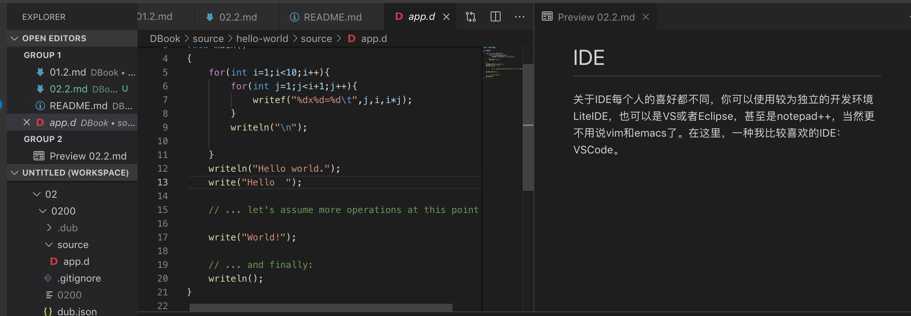

# IDE
关于IDE每个人的喜好都不同，你可以使用较为独立的开发环境LiteIDE，也可以是VS或者Eclipse，甚至是notepad++，当然更不用说vim和emacs了。在这里，一种我比较喜欢的IDE：VSCode。

## VSCode
[VSCode](https://code.visualstudio.com/)算是集成的非常好DLang IDE了，编译，调试，代码补全，功能可谓应有尽有。

安装 ext install webfreak.code-d

## [其它IDE工具](https://wiki.dlang.org/IDEs)，还有一个[链接地址](https://tour.dlang.org/tour/en/welcome/install-d-locally)

这里就不再赘述。

## 链接
- [目录](../README.md)
- [上一节](./02.1.md)
- [下一节](./02.3.md)